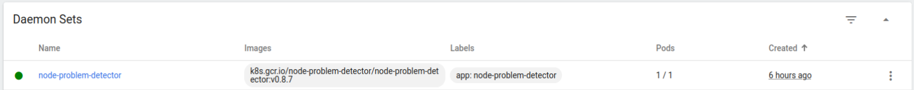
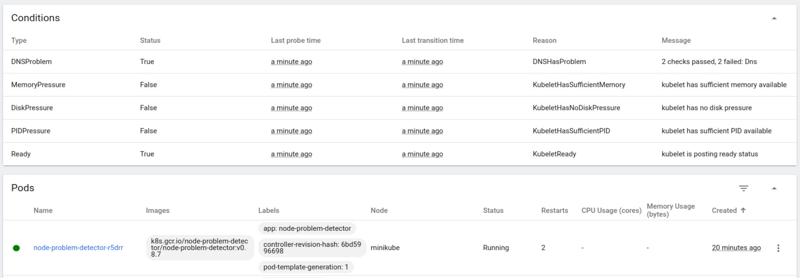

## What is npd-kdebug

node-problem-detector aims to make various node problems visible to the upstream layers in the cluster management stack. It is a daemon that runs on each node, detects node problems and reports them to apiserver. node-problem-detector can either run as a DaemonSet or run standalone. Now it is running as a Kubernetes Addon enabled by default in the GCE cluster.

In this project, we integrate the node-problem-detector with kdebug. 

## How to deploy npd-kdebug

You can run the following command to deploy the integrated daemon app to your kubernetes cluster.
```shell
kubectl deploy -f ./node-problem-detector/node-problem-detector.yaml
```

## What can npd-kdebug show you

In kubernetes dashboard, you can click `Daemon Sets` in the side bar. If you see information like the following picture, it means that npd-kdebug is working on your cluster. 


Click `Cluster` > `Nodes`, and select a node. In the 'Conditions' tag, you can see a 'DNSProblem' type. It is a type of problems that detected by kdebug, and reported to node-problem-detector, as the node-problem-detector finally shows the `Status` and `Messages`. If `Status=False`, it means there is no DNS problem. If `Status=True`, it means npd-kdebug detected some DNS problems, and error messages show in `Messages`.
