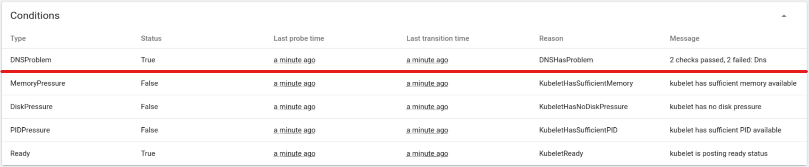
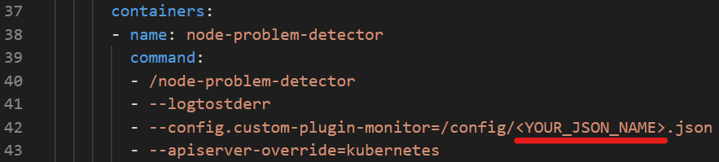
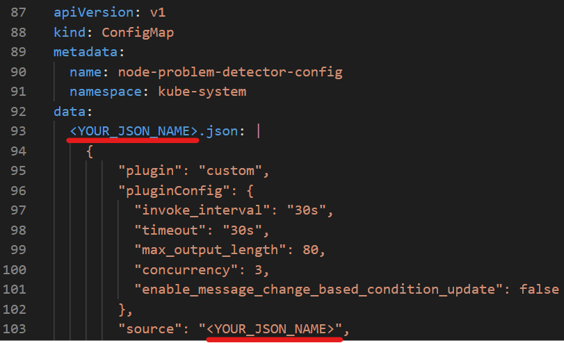

## What is npd-kdebug

node-problem-detector aims to make various node problems visible to the upstream layers in the cluster management stack. It is a daemon that runs on each node, detects node problems and reports them to apiserver. node-problem-detector can either run as a DaemonSet or run standalone. Now it is running as a Kubernetes Addon enabled by default in the GCE cluster.

In this project, we integrate the node-problem-detector with kdebug. After deploying kdebug with a specific check mode and node-problem-detector, kdebug will try to detect potential problems under the check mode. The results of the check will pass to node-problem-detector, and be reported through problem APIs of node-problem-detector. 
* `NodeCondition`: Permanent problem that makes the node unavailable for pods should
be reported as `NodeCondition`.
* `Event`: Temporary problem that has limited impact on pod but is informative
should be reported as `Event`.

We call the integration of node-problem-detector(npd) and kdebug as **npd-kdebug**.

## How to deploy npd-kdebug

We have already prepared a [sample yaml](./node-problem-detector.yaml) file for you to help you deploy the intergration application of npd-kdebug with DNS check mode. You can run the following command to deploy the integrated daemon app to your kubernetes cluster.
```shell
kubectl apply -f ./node-problem-detector/node-problem-detector.yaml
```

## What can npd-kdebug show you

### Check the npd-kdebug is ready
* In kubernetes dashboard, you can click `Daemon Sets` in the side bar. 
* If you see information like the following picture, it means that npd-kdebug is working on your cluster. 


### Check the problem detecting result of kdebug check
* Click `Cluster` > `Nodes`, and select a node. 
* In the 'Conditions' tag, you can see a `'DNSProblem'` type. It is a type of problems that detected by kdebug, and reported to node-problem-detector, as the node-problem-detector finally shows the `Status` and `Messages`. 
    * If `Status=False`, it means there is no DNS problem. 
    * If `Status=True`, it means npd-kdebug detected some DNS problems, and error messages show in `Messages`.



## Customization

Besides `DNSProblem` check, you can integrate other kdebug check modes with npd. To customize different check modes npd-kdebug, you can follow the step-by-step tutorial in this section.

* Step 1: Copy the [template yaml](./node-problem-detector-template.yaml) and open it.
* Step 2: Replace `<YOUR_JSON_NAME>` with a json file name you want at `line 42`. Recommend to include the check mode name you want to deploy. For example, `kdebug-http`.


* Step 3: Now you should edit your config json. This part of contents describe the parameters that how you run the `kdebug`, which is as the custom plugin of npd.

